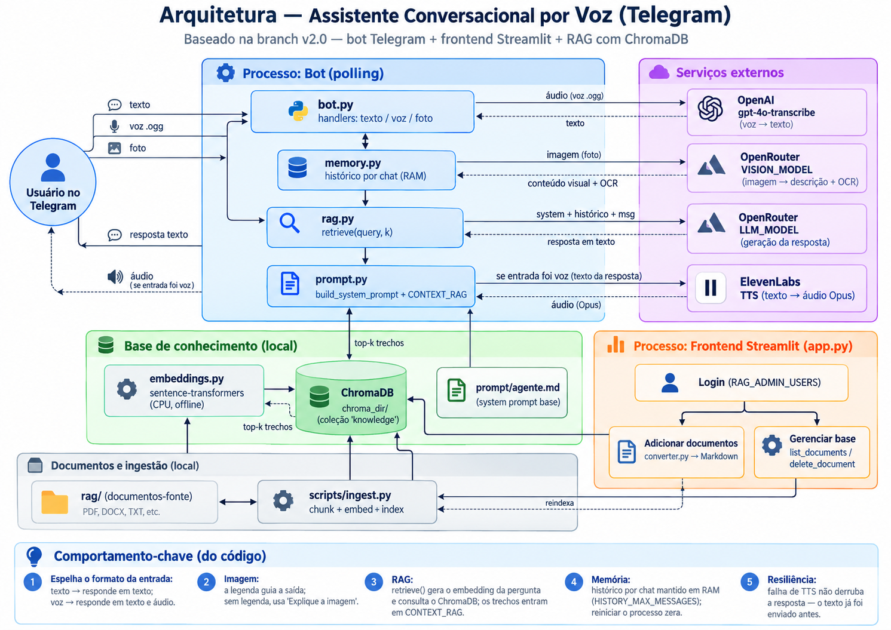

# Assistente Conversacional por Voz (Telegram)

Bot do Telegram que conversa por texto e por voz e **espelha o formato da entrada**:
responde em **texto** quando recebe texto e em **voz** quando recebe áudio.

É um assistente **generalista fundamentado em RAG**: ele não é preso a um único
tema. O conhecimento dele é definido pelos documentos que você coloca na pasta
`rag/`, seja qual for o assunto. Ele responde com base nesse material e, quando a
base não cobre a pergunta, avisa que não encontrou a informação em vez de inventar.
O comportamento, o tom e os guardrails ficam no arquivo de prompt e podem ser
editados sem mexer no código.

## Arquitetura

Dois processos independentes compartilham a mesma base de conhecimento (ChromaDB)
e o mesmo system prompt: o **bot do Telegram** (runtime em polling, atende texto,
voz e imagem) e o **frontend Streamlit** (`app.py`), usado para gerir o RAG. A
ingestão (`scripts/ingest.py`) popula a base a partir da pasta `rag/`.



O diagrama editável (Mermaid) fica em [`docs/arquitetura.md`](docs/arquitetura.md).

## Componentes

- **Cérebro (LLM):** `gpt-5.6-luna` via OpenRouter
- **Transcrição (voz → texto):** `gpt-4o-transcribe` (OpenAI), forçada para português
- **Voz (texto → áudio):** ElevenLabs (saída em Opus, formato nativo de voice message)
- **Conhecimento (RAG):** ChromaDB local + **embeddings locais** via
  `sentence-transformers` (sem custo de API para embeddings)
- **Memória:** histórico de conversa por chat, em RAM (reiniciar o processo zera)

## Como rodar (local)

### 1. Instalar dependências

```bash
uv sync
```

### 2. Configurar credenciais

```bash
cp .env.example .env
```

Edite o `.env` com o token do Telegram (via @BotFather) e as chaves do OpenRouter,
OpenAI (usada só para transcrição de voz) e ElevenLabs. O `.env` não é versionado.

### 3. Alimentar a base de conhecimento

Coloque seus documentos (`.md`, `.txt`, `.pdf`) na pasta `rag/` e rode a ingestão
(ou use o frontend de upload descrito abaixo, que aceita mais formatos),
que fatia os textos, gera os embeddings localmente e popula o ChromaDB:

```bash
uv run python -m scripts.ingest
```

Rode novamente sempre que adicionar ou alterar documentos em `rag/`. O primeiro uso
baixa o modelo de embeddings (uma vez).

#### Frontend de gestão do RAG (opcional)

Em vez de copiar arquivos manualmente para `rag/`, você pode usar a interface web
para gerenciar a base:

```bash
uv run streamlit run app.py
```

O acesso é protegido por um **login simples** (sem senha — é uma POC): informe um
usuário presente em `RAG_ADMIN_USERS` no `.env` (lista separada por vírgula, ex.:
`RAG_ADMIN_USERS=marcu,admin`). O login serve só para separar a gestão do uso comum.

> **Aviso:** login sem senha não protege de verdade. Use apenas localmente; não
> exponha esse frontend na internet sem uma autenticação real.

Depois de entrar, há duas páginas:

- **Adicionar documentos:** aceita `.txt`, `.md`, `.docx`, `.csv`, `.xlsx`, `.pdf`
  e imagens (`.png`, `.jpg`, `.jpeg`, `.webp`, `.gif`, `.bmp`), converte cada um
  para Markdown (formato limpo que facilita o embedding), salva em `rag/` e, se
  você marcar a opção, já dispara a reindexação.
- **Gerenciar base:** lista os documentos indexados no banco vetorial (ChromaDB)
  com a contagem de trechos de cada um, aponta arquivos que estão em `rag/` mas
  ainda não foram indexados, e permite **excluir** um documento — removendo os
  trechos do banco e, opcionalmente, o arquivo de origem em disco (com confirmação).

A conversão fica na classe `DocumentConverter` (`src/assistente_telegram_voz/converter.py`),
que também pode ser usada por código:

```python
from assistente_telegram_voz.converter import DocumentConverter

conv = DocumentConverter()
conv.convert_file("relatorio.docx", out_dir="rag")   # gera rag/relatorio.md
```

**Imagens:** quando o arquivo é uma imagem, o conversor não tenta ler texto direto —
ele envia a imagem a um modelo de visão (via OpenRouter) que **descreve o conteúdo**
e faz **OCR** do texto embutido, retornando um Markdown com as duas seções. O modelo
é configurável pela variável `VISION_MODEL` no `.env` (padrão `openai/gpt-4o-mini`) e
usa a mesma `OPENROUTER_API_KEY` do assistente. Diferente dos outros formatos, essa
conversão faz uma chamada de rede e depende de crédito/modelo multimodal disponível.

Antes de enviar, a imagem passa por um **pré-processamento** (via Pillow) que a
redimensiona e recomprime para reduzir custo e latência, sem perder legibilidade do
texto. Dá para ajustar no `.env`:

- `VISION_MAX_IMAGE_PX` (padrão `1536`) — maior lado permitido; imagens maiores são
  reduzidas mantendo a proporção.
- `VISION_IMAGE_QUALITY` (padrão `85`) — qualidade JPEG (1–95) usada ao recomprimir
  imagens sem transparência (imagens com transparência viram PNG).

### 4. Personalizar o assistente (opcional)

Edite `prompt/agente.md` para ajustar identidade, escopo, tom e guardrails. O
caminho do prompt é configurável pela variável `SYSTEM_PROMPT_PATH` no `.env`.

### 5. Iniciar o bot

```bash
uv run python -m assistente_telegram_voz.bot
```

O bot fica em **polling** (puxa as mensagens do Telegram), então **não precisa de
domínio, IP público nem porta aberta** — só acesso de saída à internet. Mande uma
mensagem de texto ou de voz para o bot.

> Só uma instância do bot pode rodar por token ao mesmo tempo. Rodar duas (por
> exemplo, local e container) causa o erro `Conflict` do Telegram.

## Como rodar (Docker)

A imagem usa PyTorch CPU-only para ficar enxuta. Os dados (`.env`, `rag/`,
`chroma_db/`, `prompt/`) ficam fora da imagem e entram via volumes/env.

```bash
docker compose up --build -d      # sobe o bot em background
docker compose logs -f            # acompanha os logs
docker compose down               # para o bot
```

O `docker-compose.yml` monta `./chroma_db`, `./prompt` e `./rag` como volumes e lê
o `.env`. Se a base (`chroma_db/`) já existir na máquina, o container a reutiliza.
Em um servidor limpo, gere a base primeiro — rodando a ingestão localmente e
copiando `chroma_db/`, ou executando a ingestão dentro do container:

```bash
docker compose run --rm bot uv run python -m scripts.ingest
```

## Testes

```bash
uv run pytest
```

## Estrutura

```
prompt/agente.md   # system prompt do assistente (editável; escopo, tom, guardrails)
rag/               # documentos-fonte da base de conhecimento (não versionados)
chroma_db/         # índice vetorial gerado (não versionado)
app.py             # frontend Streamlit: gestão do RAG (upload + listar/excluir) com login
scripts/ingest.py  # ingestão: lê rag/, gera embeddings e popula o ChromaDB
src/assistente_telegram_voz/
  config.py        # carrega e valida o .env
  converter.py     # converte .txt/.docx/.csv/.xlsx/.pdf/imagens -> .md (DocumentConverter)
  image.py         # interpreta imagens + OCR via modelo de visão (OpenRouter)
  memory.py        # histórico de conversa por chat (em RAM)
  prompt.py        # monta o system prompt + contexto recuperado (CONTEXT_RAG)
  rag.py           # busca trechos no ChromaDB + gestão (listar/excluir documentos)
  embeddings.py    # embeddings locais (sentence-transformers)
  transcribe.py    # áudio -> texto (OpenAI)
  tts.py           # texto -> áudio (ElevenLabs)
  llm.py           # geração de resposta (OpenRouter)
  bot.py           # orquestração e handlers do Telegram
Dockerfile / docker-compose.yml   # execução em container
```
