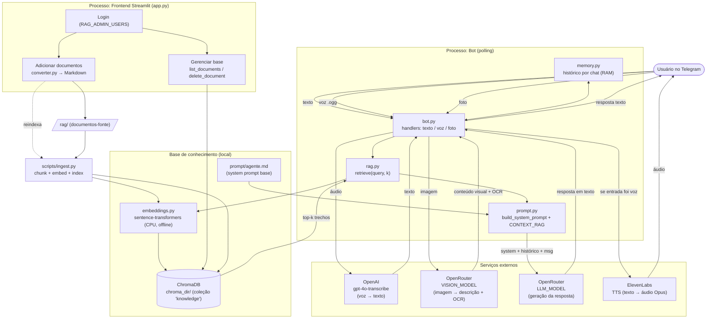

# Arquitetura — Assistente Conversacional por Voz (Telegram)

Diagrama baseado no código da branch `v2.0`. Dois processos independentes
compartilham a mesma base de conhecimento (ChromaDB) e o mesmo system prompt:

- **Bot do Telegram** (`assistente_telegram_voz.bot`): runtime em polling que
  atende texto, voz e imagem.
- **Frontend Streamlit** (`app.py`): gestão do RAG (upload/conversão + listar/excluir),
  atrás de login simples.
- **Ingestão** (`scripts/ingest.py`): CLI que popula o ChromaDB a partir de `rag/`.

## Fluxo geral



## Comportamento-chave (do código)

- **Espelha o formato da entrada:** texto → responde em texto; voz → responde em
  texto **e** áudio (o texto é enviado primeiro; o áudio chega em seguida).
- **Imagem:** a legenda guia a saída; sem legenda, usa "Explique a imagem".
- **RAG:** `retrieve()` gera o embedding da pergunta (local, CPU, modo offline) e
  consulta o ChromaDB; os trechos entram no bloco `CONTEXT_RAG` do system prompt.
- **Memória:** histórico por chat mantido em RAM (`HISTORY_MAX_MESSAGES`); reiniciar
  o processo zera.
- **Resiliência:** falha de TTS não derruba a resposta — o texto já foi enviado antes.

```

```
